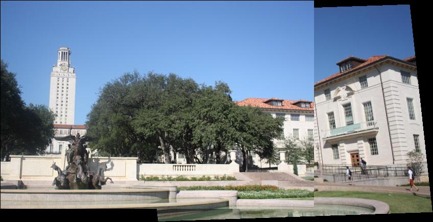
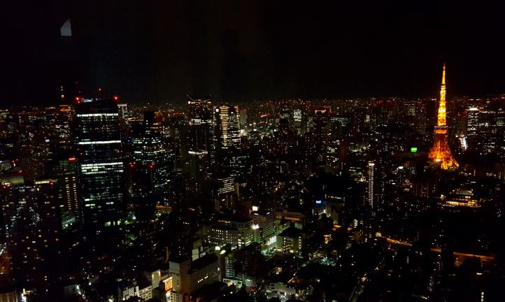
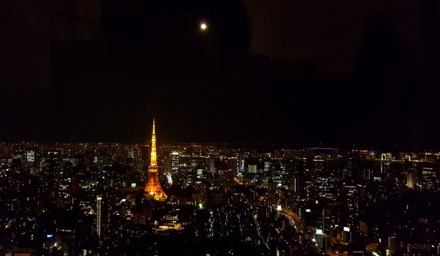
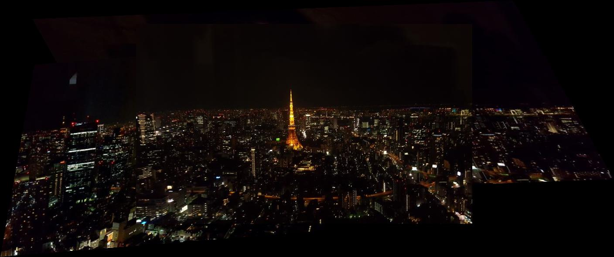
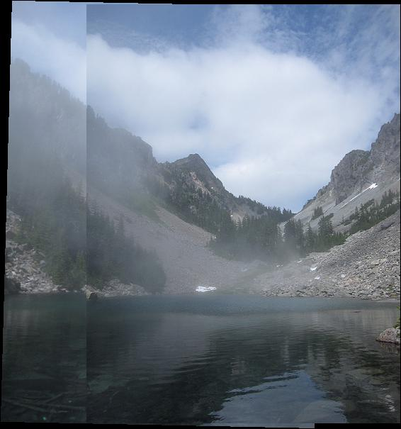
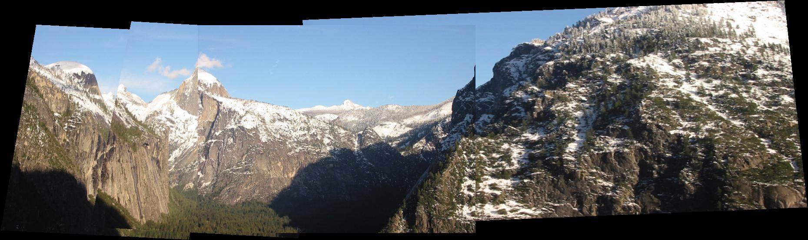

# 劉祐欣 Yuhliu<span style="color:red">(105062536)</span>
# Project 2 / Panorama Stitching

## Overview
<pre>
The project is related to 
> Download and setup vlfeat to detect SIFT points.
> Matching SIFT Descriptors
> Fitting the Transformation Matrix
> Cost function in RANSAC
> Compute the matrix to convert given frame into the given reference frame
</pre>

## Implementation
1. Euclidean distance between a given SIFT descriptor from image1 and that from image2
	* Repeat each row in descriptor1 to the same size of descriptor2(using repmat)
	* calculate the Euclidean distance for each row
	* sort the distance vector in ascending order, pick the first two result to compare.If the ratio is smaller than thresh, then it is a match
	```
	[N1,~]=size(descriptor1);
	[N2,~]=size(descriptor2);

	for i=1:N1
		tempi = repmat(descriptor1(i,:),[N2,1]);
		squDis_Element = (tempi-descriptor2).^2;
		squDist = sum(squDis_Element,2).^0.5;
		[sortedElement,ind]=sort(squDist);

		if sortedElement(1)/sortedElement(2) < thresh
		    match=[match;i,ind(1)];
		end        
	end
	```
	And the result of running EvaluateSIFTMatcher is :
	```
	Your error with the reference solution...

	ans =

	     0
	```
2. Fitting the Transformation Matrix
	* Knowing that P1'*H'=P2', H can simply computed by:
	```
	H = (P1'\P2')';
	```
	And the result of running EvaluateAffineMatrix is :
	```
	Difference from reference solution: 4.9304e-32
	Accepted!
	```
3. Cost function in RANSAC
	* Transform data points in pt1 by using H.
	* compute the error between transformed pt1 and pt2.(Using Euclidean distance)
	```
	dists = zeros(size(match,1),1);

	    N1 = size(pt1,1);
	    tran_pt1 = [pt1';ones(1,N1)];
	    PT_1 = (H*tran_pt1(:,1:N1))';

	    squElementDist = PT_1(match(:,1),1:2)-pt2(match(:,2),:).^2;
	    dists(:,1)=sum(squElementDist,2).^0.5;
	```
The result of running TransformationTester is:<br>
<br>
4. Compute the matrix to convert given frame into the given reference frame
	* Stitching ordered sequence of images
		* set the smaller index between the index of current frame and refference frame as the start index
		* multiply matrices from start index to the distance between the 2 input indices.
		* if refference index is smaller, inverse the result in step 2.
	```
	T=eye(3,3);
	start=min(refFrameIndex,currentFrameIndex);
	for i=start:start+abs(refFrameIndex-currentFrameIndex)-1   
	    T = T * i_To_iPlusOne_Transform{i};
	end
	if refFrameIndex < currentFrameIndex
	    T = pinv(T);
	end
	```
	The result is showing in the following part 'Results'.
	
## Installation
* [VLFeat 0.9.17 binary package](http://www.vlfeat.org/download/vlfeat-0.9.20-bin.tar.gz).<br>
* How to compile from source?<br>
> Let VLFEATROOT denote this directory. VLFeat must be added to MATLAB search path by running the vl_setup command found in the VLFEATROOT/toolbox directory. run:
```
run('VLFEATROOT/toolbox/vl_setup')
```
* To check the implementation of matching SIFT descriptors:
```
EvaluateSIFTMatcher
```
* To check the implementation of finding a transformation matrix H:
```
EvaluateAffineMatrix
```
* To check the implementation of the cost function which determines how well two points are related by a given matrix H:
```
TransformationTester
```
* To check the implementation of constructing matrix T converting the given frame into the given reference frame:
```
StitchTester
```
### Results

**japan**<br>
This is the picture when I went to Japen in my graduation trip.<br>
I was in the Tokyo Skytree, and there are 3 pictures I took in different angles.<br>
<br>
Here is **the three origin images**:<br>
<table>
<td ALIGN=center>



</td>
</table>
Panoramic stitching does help to concatenating these pictures well. <br>
**This is the result**:<br>


**Other datas**<br>
The data given to test. Including 'MelakwaLake.jpg','Hanging.jpg','yosemite.jpg',and 'uttower_pano.jpg'<br>
<table>
<td ALIGN=center>




</td>
</table>

